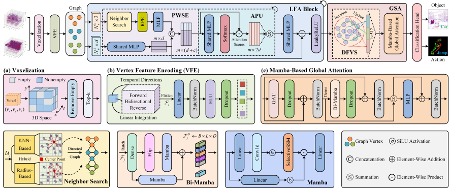
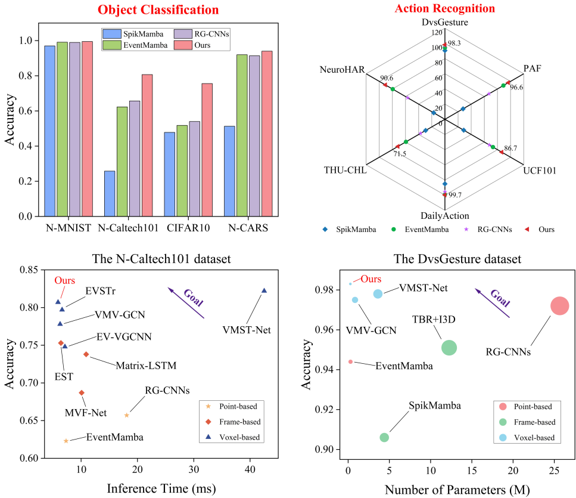

# SVG-Mamba: An Efficient Local-to-Global Sparse Voxel Graph Mamba for Event Stream Recognition

The complete code will be released after the paper is published.

## Overview

We propose a sparse voxel graph Mamba (SVG-Mamba), which combines message-passing graph neural networks (GNNs) with state space models (SSMs) to efficiently model local-to-global spatiotemporal contextual relationships in variable-length event sequences. First, we convert event data into sparse voxel graphs to preserve its sparsity. To mitigate the limitations of GNNs in temporal modeling, we introduce a vertex feature encoding (VFE) module to perform linear integration of internal event points within each graph vertex along three temporal directions. Subsequently, we design a multi-stage local feature aggregation (LFA) block that integrates point-wise spatial encoding (PWSE), attention pooling units (APU), and dilated residual connections (DRC), facilitating the network to focus on fine-grained local information. Finally, we implement spatiotemporal modeling that expands from local vertex receptive fields to global context through hierarchical dynamic farthest vertex sampling (DFVS) and Mamba-based global attention. This lightweight model is designed for event-based object classification and action recognition, achieving a suitable trade-off between accuracy and efficiency.



## Performance

Extensive experimental results show that our proposed SVG-Mamba not only achieves higher accuracy but also exhibits significant advantages in terms of inference speed for event-based visual tasks such as object classification and action recognition.



## Installation

### Requirements

All the codes are tested in the following environment:

- Linux (Ubuntu 20.04)
- Python 3.12
- PyTorch 2.4.0
- CUDA 11.8

### Dataset Preparation

All datasets should be downloaded and placed within the `dataset` directory, adhering to the folder naming rules and structure specified for the examples (`N-Caltech101` and `DvsGesture` datasets) as provided in the project.

## Quick Start

Clone the repository to your local machine:

```
git clone https://github.com/hust-fstudy/SVG-Mamba
cd SVG-Mamba
```

Once the dataset is specified in the `dataset_dict` dictionary within the `main` function of the `run_recognition.py` file, we can train and test it using the following command:

```bash
python run_recognition.py
```

